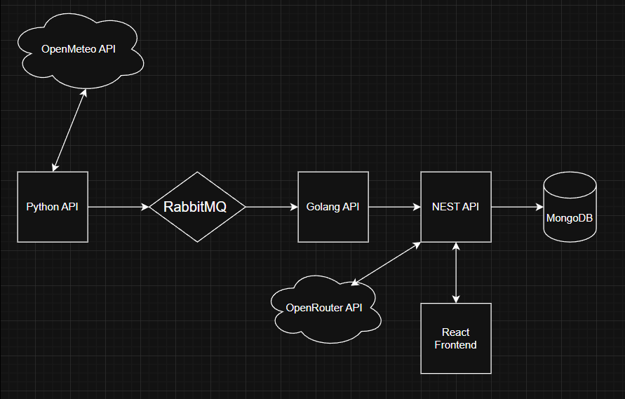

# 🌦️ GDASH 2025-02 - Weather Monitoring System

[](https://youtu.be/GNXF8Uf2SYY)

Demonstração completa do sistema funcionando: [https://youtu.be/GNXF8Uf2SYY](https://youtu.be/GNXF8Uf2SYY)

Real-time weather monitoring system with microservices architecture. Collects climate data from Alagoas, Brazil and provides REST API with authentication.

## 🚀 Quick Start

### 1. Clone and Start
```bash
git clone https://github.com/JoaoVitorML-BR/joao-vitor-desafio-gdash-2025-02.git
cd joao-vitor-desafio-gdash-2025-02

# Windows (starts Docker services + React frontend)
start-all.bat

# Linux/Mac (Docker services only)
docker-compose up -d --build

# Linux/Mac: In a separate terminal, start React frontend
cd react-weather-dashboard
npm install  # Only needed first time
npm run dev
```

### 2. Wait for Services (~30s)
```bash
# Windows: use logs.bat
# Linux/Mac: docker-compose logs -f
```

### 3. ⚠️ Create First User (Admin Master)

**IMPORTANT**: The first registered user becomes the **Admin Master** automatically.

Use Swagger or Insomnia to create it:

**Endpoint**: `POST http://localhost:9090/api/v1/auth/register`

**Body**:
```json
{
  "name": "Gadash Desafio",
  "email": "gadash@admin.com",
  "password": "Teste1@"
}
```

**Response**:
```json
{
  "user": {
    "_id": "...",
    "name": "Gadash Desafio",
    "email": "gadash@admin.com",
    "role": "admin"
  },
  "access_token": "eyJhbGciOiJIUzI1NiIs..."
}
```

After that, use this user to login and create other admins or regular users.

### 4. Access Services

| Service | URL | Credentials |
|---------|-----|-------------|
| **React Dashboard** | http://localhost:5173 | - |
| **Swagger API Docs** | http://localhost:9090/api | - |
| **NestJS API** | http://localhost:9090 | - |
| **RabbitMQ UI** | http://localhost:15672 | `guest:guest` |
| **Mongo Express** | http://localhost:9091 | - |

## 📋 Architecture



### Data Flow
1. **Python**: Fetches weather data every minute
2. **RabbitMQ**: Message queue for async processing
3. **Go Worker**: Filters and transforms data (13 → 7 fields)
4. **NestJS**: Validates, stores in MongoDB, serves REST API
5. **MongoDB**: Persistent storage

### Collected Data (7 fields)
- `id`, `fetched_at`, `latitude`, `longitude`
- `temperature` (°C), `humidity` (%), `precipitation_probability` (%)

## 🛠️ Technologies

- **Backend**: Python 3.11, Go 1.24, NestJS 11 (TypeScript)
- **Database**: MongoDB 6
- **Message Broker**: RabbitMQ 3.11
- **Auth**: JWT tokens
- **Docs**: Swagger/OpenAPI
- **DevOps**: Docker Compose

## 📚 API Endpoints

### Authentication (Public)
- `POST /api/v1/auth/register` - Register user (first = admin)
- `POST /api/v1/auth/login` - Login

### Users (Authenticated)
- `GET /api/v1/users` - List users (admin only)
- `POST /api/v1/auth/register-admin` - Create admin (admin only)

### Weather Logs
- `GET /api/v1/weather/logs` - List logs (authenticated)
- `GET /api/v1/weather/logs/:id` - Get specific log
- `POST /api/v1/weather/logs` - Create log (used by Go Worker)

Full documentation: http://localhost:9090/api

## 📁 Project Structure

```
├── py-openmeteo-api/      # Python collector
├── go-worker-api/         # Go transformer
├── nest-weather-api/      # NestJS API
├── docker-compose.yml     # All services
└── README.md
```

## 🔧 Environment Variables

Create `.env` file (optional, defaults work):

```bash
# Database
DB_USER=admin
DB_PASS=12345
DB_NAME=weather_data

# NestJS
PORT=9090
JWT_SECRET=your_secret_here

# Coordinates (Alagoas, Brazil)
OPENMETEO_LAT=-9.747399554832585
OPENMETEO_LON=-36.666791770043595
```

## 🧪 Development

Each service has individual `docker-compose.yml`:

```bash
# Python only
cd py-openmeteo-api && docker-compose up

# Go Worker only
cd go-worker-api && docker-compose up

# NestJS only
cd nest-weather-api && docker-compose up
```

---

## 📚 Documentação Detalhada por Serviço

| Serviço | Descrição | Documentação |
|---------|-----------|--------------|
| 🟢 **NestJS Weather API** | Backend principal com autenticação JWT e AI insights | [📖 README](./nest-weather-api/README.md) |
| 🐍 **Python OpenMeteo Worker** | Worker de coleta de dados meteorológicos | [📖 README](./py-openmeteo-api/README.md) |
| 🔵 **Go Worker API** | Processador e transformador de dados | [📖 README](./go-worker-api/README.md) |
| ⚛️ **React Weather Dashboard** | Interface web do dashboard | [📖 README](./react-weather-dashboard/README.md) |

---

## 📝 License

Developed for GDASH 2025-02 challenge.

## 👤 Author

**João Vitor** - [@JoaoVitorML-BR](https://github.com/JoaoVitorML-BR)